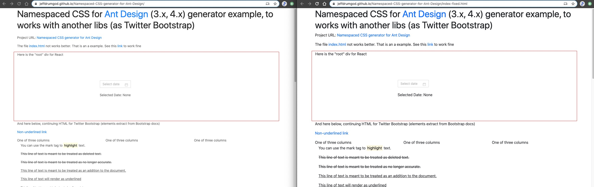

<h1>Reliable Ant-Design (antd 3.x, 4.x) CSS with all rules prefixed ("namespaced")</h1>

    <a href="https://jeffdrumgod.github.io/Namespaced-CSS-generator-for-Ant-Design/">Click here</a> to see an example with problems caused by not overwriting CSS rules.
     
    And after, <a href="https://jeffdrumgod.github.io/Namespaced-CSS-generator-for-Ant-Design/index-fixed.html">click here</a> to see an example with fixed bugs.

**Note:** The Twitter Bootstrap, in these examples, can affect items of Ant.Design, but in reverse case, not. It's good when we want to use Ant.design in another project already in production.

Thanks to <a href="https://gist.github.com/sbusch/a90eafaf5a5b61c6d6172da6ff76ddaa" target="_blank" rel="noopener">@sbusch</a> for start this method, and to <a href="https://github.com/dbtedman">@dbtedman</a> for making this possible with his fine PostCSS <a href="https://github.com/dbtedman/postcss-prefixwrap">postcss-prefixwrap</a> plugin.

This project was bootstrapped with [Create React App](https://github.com/facebookincubator/create-react-app).
